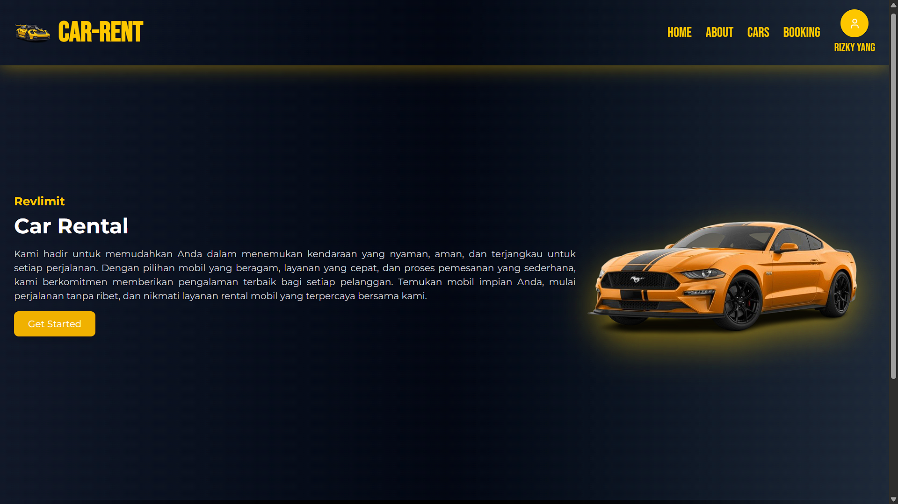

# 🚗 RevLimit CAR-RENT

CAR-RENT adalah aplikasi web modern berbasis **React.js** dan **.NET Core API** untuk penyewaan mobil dengan fitur autentikasi, manajemen profil, daftar mobil, sistem booking, serta role **Admin** & **User**.  

---

## ✨ Fitur Utama
- 🔑 **Autentikasi** (Register, Login, Update Password)  
- 👤 **Manajemen Profil** (edit data profil, ubah password)  
- 🚘 **Daftar Mobil** (lihat mobil tersedia lengkap dengan detail)  
- 📅 **Sistem Booking** (buat booking, cek riwayat, detail booking)  
- 🛠️ **Role Management** (Admin dapat mengelola data booking & user)  
- 🎨 **UI Modern** dengan animasi **Framer Motion** dan ikon **Lucide React**  

---

## 🖥️ Preview
> Tambahkan screenshot di folder project kamu lalu tampilkan di sini.

---

## 🛠️ Tech Stack
**Frontend**
- React.js (Vite)
- TailwindCSS
- Framer Motion
- Lucide React

**Backend**
- .NET Core Web API
- Entity Framework Core
- SQL Server / PostgreSQL (opsional)

---

## 🔑 Login Role
- **Admin**: bisa mengelola semua booking & data user  
- **User**: bisa melihat mobil, membuat booking, dan mengelola profil sendiri  

---

## 📜 License
Project ini dibuat untuk tujuan pembelajaran. Bebas digunakan dan dikembangkan lebih lanjut.  

---

## 👨‍💻 Author
Dikembangkan oleh **[Afi Naufal Rizky Yang]** 🚀
